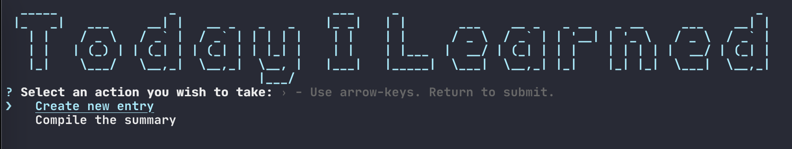

This is inspired by https://github.com/narze/til

## All Entries

### Docker

- [Run cronjob along with php-fpm](./entries/Docker/2021_09_08_run_cronjob_along_with_php-fpm.md) - 2021-09-08
- [Install a specific nodejs version using n](./entries/Docker/2021_09_10_install_a_specific_nodejs_version_using_n.md) - 2021-09-10

### Elasticsearch

- [Multi search API](./entries/Elasticsearch/2021_09_04_multi_search_api.md) - 2021-09-04

### Git

- [Use Git commit-msg hook to validate commit message](./entries/Git/2021_09_03_use_git_commit-msg_hook_to_validate_commit_message.md) - 2021-09-03
- [Multi SSH Keys settings for different github accounts](./entries/Git/2021_09_04_multi_ssh_keys_settings_for_different_github_accounts.md) - 2021-09-04

### Go

- [Format a date or time in Golang](./entries/Go/2021_09_05_format_date_or_time_in_golang.md) - 2021-09-05

### Javascript

- [Build CLI with NodeJs](./entries/Javascript/2021_09_02_build_cli_with_nodejs.md) - 2021-09-02
- [Get all directories within directory with NodeJs](./entries/Javascript/2021_09_03_get_all_directories_within_directory_with_nodejs.md) - 2021-09-03

### Mac

- [Find and kill process locking port](./entries/Mac/2021_09_04_find_and_kill_process_locking_port.md) - 2021-09-04

### PHP

- [Detect N+1 query in Laravel](./entries/PHP/2020_06_03_detect_n+1_query_in_laravel.md) - 2020-06-03
- [Use index or force index in Laravel](./entries/PHP/2020_06_04_use_index_or_force_index_in_laravel.md) - 2020-06-04
- [Check the relationship has been loaded in Laravel](./entries/PHP/2020_06_08_check_the_relationship_has_been_loaded_in_laravel.md) - 2020-06-08
- [Use isset() instead of strlen() in PHP](./entries/PHP/2020_06_15_use_isset_instead_of_strlen_in_php.md) - 2020-06-15
- [Batch processing of requests with Elasticsearch PHP client](./entries/PHP/2021_09_04_batch_processing_of_requests_with_elasticsearch_php_client.md) - 2021-09-04
- [Laravel artisan everywhere](./entries/PHP/2021_09_05_laravel_artisan_everywhere.md) - 2021-09-05
- [Destroy all sessions in Laravel](./entries/PHP/2021_09_11_destroy_all_sessions_in_laravel.md) - 2021-09-11

## CLI Usage

- `yarn install`
- `yarn link`
- `til`
- `til --action="new"` Create new entry
- `til --action="compile"` Compile summary & rebuild README
